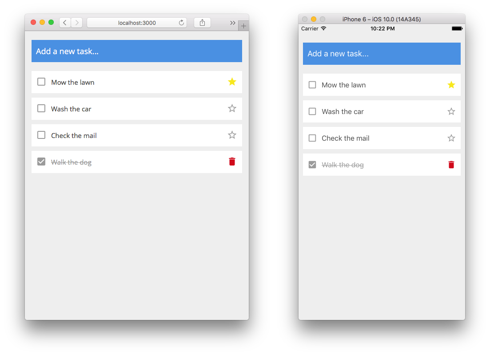

---

## To Run Locally

```bash
$ cd ~/Desktop
$ git clone https://github.com/griffinsockwell/react-firebase-crud.git
```

Make sure [Node.js](https://nodejs.org/) is installed.

Login to [Firebase](https://www.firebase.com/) and create a new app from the dashboard.

Change the firebase url in two different files.

* TaskAppMobile/src/firebaseUrl.js
* TaskAppWeb/src/firebaseUrl.js

```js
import Firebase from 'firebase'

export default new Firebase("https://<your-project-name>.firebaseio.com/tasks/")
```

### To run the Web App

Change into the web app directory.
```bash
$ cd TaskAppWeb
```

Install the node modules.
```bash
$ npm install
```

Install the firebase-tools.
```bash
$ npm install -g firebase-tools
```

There is a script in package.json to generate the public/bundle.js and serve the project.
```bash
$ npm run serve
```

### To run the Mobile App

Make sure React Native is [setup](https://facebook.github.io/react-native/docs/getting-started.html#content) properly.

Change into the mobile app directory.
```bash
$ cd TaskAppMobile
```

Install the node modules.
```bash
$ npm install
```

Start the development server.
```bash
$ npm start
```

In a new tab.
```bash
$ react-native run-ios
```

---

## License

The MIT License (MIT)

Copyright (c) 2016 Griffin Sockwell

Permission is hereby granted, free of charge, to any person obtaining a copy of this software and associated documentation files (the "Software"), to deal in the Software without restriction, including without limitation the rights to use, copy, modify, merge, publish, distribute, sublicense, and/or sell copies of the Software, and to permit persons to whom the Software is furnished to do so, subject to the following conditions:

The above copyright notice and this permission notice shall be included in all copies or substantial portions of the Software.

THE SOFTWARE IS PROVIDED "AS IS", WITHOUT WARRANTY OF ANY KIND, EXPRESS OR IMPLIED, INCLUDING BUT NOT LIMITED TO THE WARRANTIES OF MERCHANTABILITY, FITNESS FOR A PARTICULAR PURPOSE AND NONINFRINGEMENT. IN NO EVENT SHALL THE AUTHORS OR COPYRIGHT HOLDERS BE LIABLE FOR ANY CLAIM, DAMAGES OR OTHER LIABILITY, WHETHER IN AN ACTION OF CONTRACT, TORT OR OTHERWISE, ARISING FROM, OUT OF OR IN CONNECTION WITH THE SOFTWARE OR THE USE OR OTHER DEALINGS IN THE SOFTWARE.
